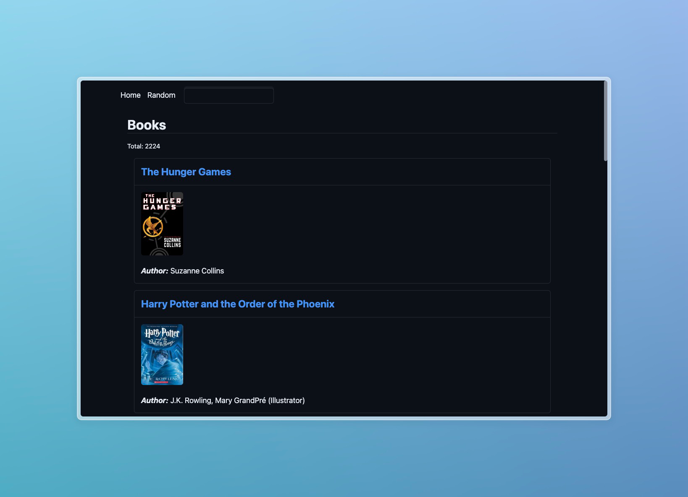
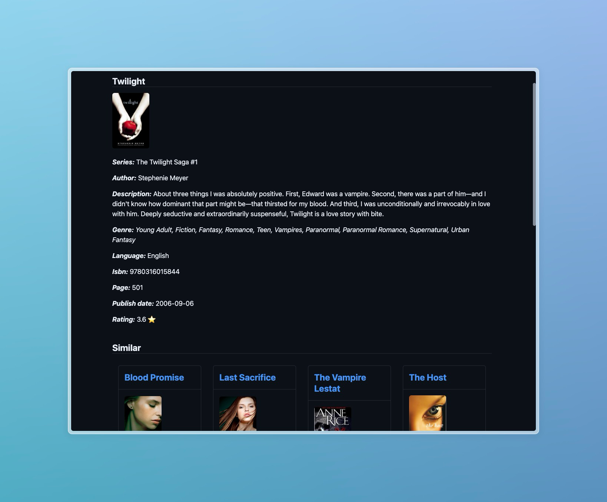
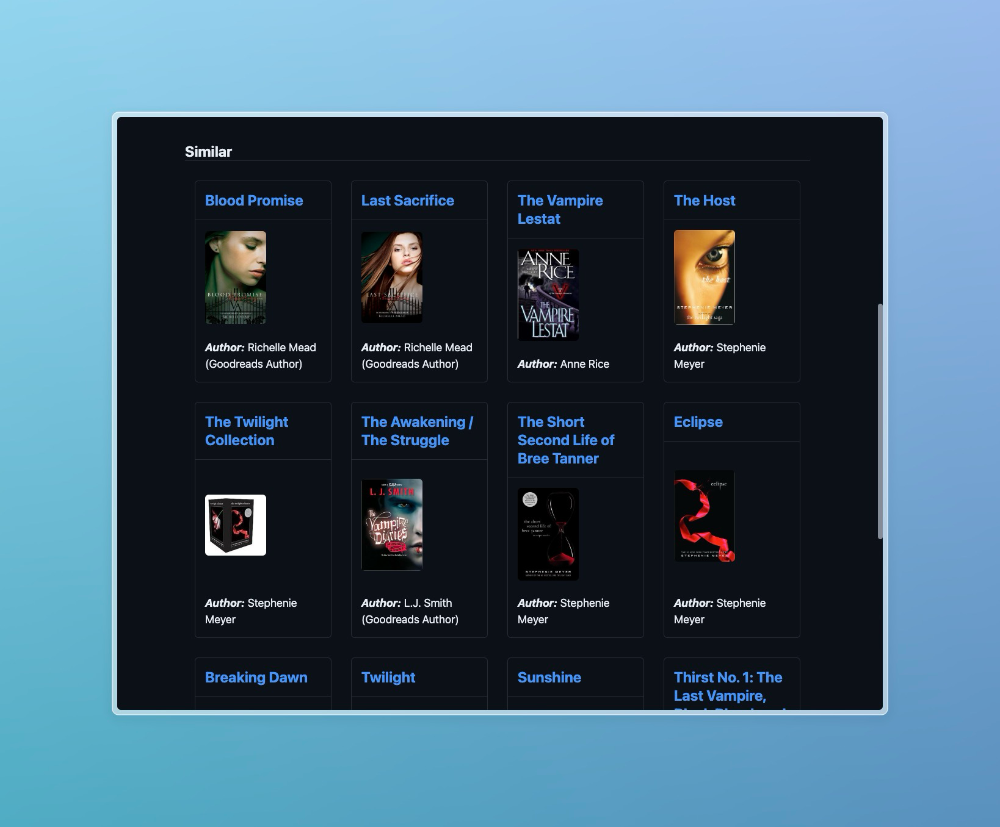

# book-neighbor

Small experimental Rails app to build a feature with `text -> vector -> embedding -> search`.

## Stack

The idea was to run and host everything locally without any dependencies. Just a app and a docker-compose file.
In many cases, tutorials simply use OpenAI API to transform and new fancy services to store and search.

### Data

This app seed for books is from [GoodReads Best Book](https://www.kaggle.com/datasets/thedevastator/comprehensive-overview-of-52478-goodreads-best-b?resource=download) datasets.

### Transform

To transform the book information into vectors this use [Text Embeddings Inference](https://huggingface.co/docs/text-embeddings-inference/index.html) from Hugging Face.
It run locally with a Docker container with the [WhereIsAI/UAE-Large-V1](https://huggingface.co/WhereIsAI/UAE-Large-V1) model. The [GitHub repo](https://github.com/huggingface/text-embeddings-inference) as more information.
See [docker-compose.yml](./docker-compose.yml).

### Embedding and storing

The vectors are stored into a Postgres database with the [`pg_vector`](https://github.com/pgvector/pgvector) extension.
See [docker-compose.yml](./docker-compose.yml).

### Search

To search the nearness neighbor in pg_vector, the app use the [ankane/neighbor](https://github.com/ankane/neighbor) gem
to integrate with ActiveRecord. But the SQL is relatively simple and can be done without the gem.

## Showcase

